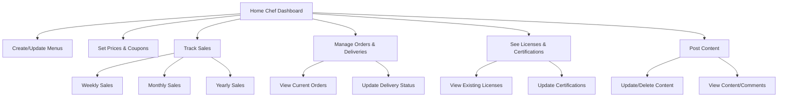

```mermaid
graph TD
    A[Home Chef Dashboard]
    A --> B[Create/Update Menus]
    A --> C[Set Prices & Coupons]
    A --> D[Track Sales]
    D --> D1[Weekly Sales]
    D --> D2[Monthly Sales]
    D --> D3[Yearly Sales]
    A --> E[Manage Orders & Deliveries]
    E --> E1[View Current Orders]
    E --> E2[Update Delivery Status]
    A --> F[See Licenses & Certifications]
    F --> F1[View Existing Licenses]
    F --> F2[Update Certifications]
    A --> G[Post Content]
    G --> G1[Update/Delete Content]
    G --> G2[View Content/Comments]

```
